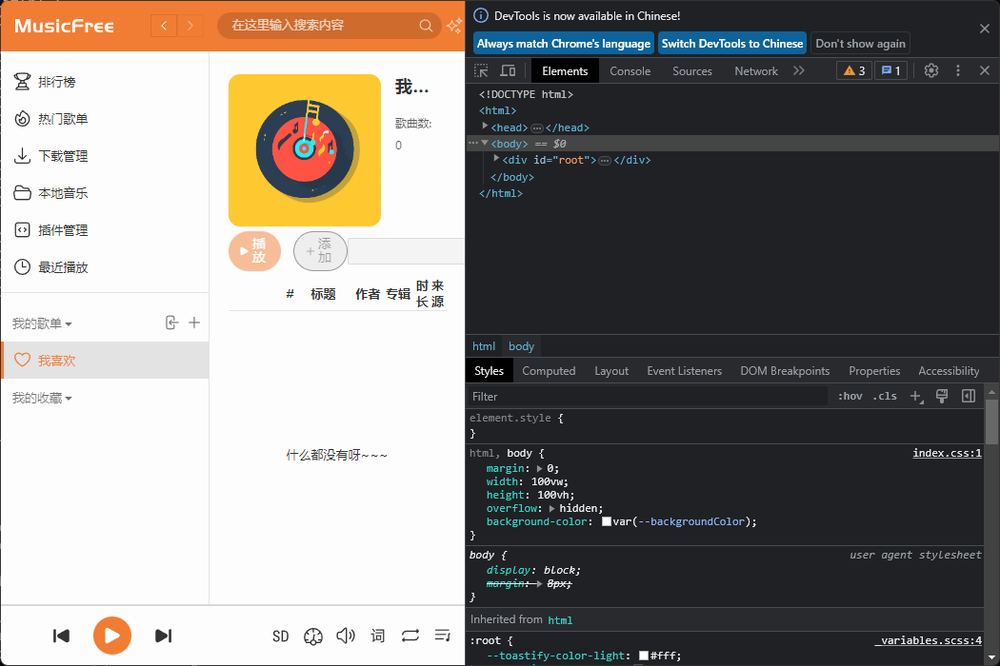

# musicfree 依赖项安装

记录自己如何配置环境实现 [MusicfreeDesktop](https://github.com/maotoumao/MusicFreeDesktop)在本地的运行。建议先看*node-sass*一部分，应该可以免去前面对vs和python的要求，VS和python大概是用于本地编译node-sass的。

## visual studio

visual studio 需要c++ desktop, win10sdk, 主机环境为win11.

相关的log:

```pwsh
npm error gyp verb find VS msvs_version not set from command line or npm config
npm error gyp verb find VS VCINSTALLDIR not set, not running in VS Command Prompt
npm error gyp verb find VS checking VS2022 (17.10.35027.167) found at:
npm error gyp verb find VS "D:\VisualStudio\ide"
npm error gyp verb find VS - found "Visual Studio C++ core features"
npm error gyp verb find VS - found VC++ toolset: v143
npm error gyp verb find VS - found Windows SDK: 10.0.20348.0
npm error gyp info find VS using VS2022 (17.10.35027.167) found at:
npm error gyp info find VS "D:\VisualStudio\ide"
npm error gyp info find VS run with --verbose for detailed information
```

参考：https://stackoverflow.com/questions/57879150/how-can-i-solve-error-gypgyp-errerr-find-vsfind-vs-msvs-version-not-set-from

`npm config edit`打开.npmrc, 添加以下内容：

```txt
;2024/7/14 jzl edited
msvs_version=2022
msbuild_path="D:\VisualStudio\ide\MSBuild\Current\Bin\MSBuild.exe"

;end of edit
```

再次npm install, 输出相关log: 

```pwsh
npm error gyp verb find VS msvs_version was set from command line or npm config
npm error gyp verb find VS - looking for Visual Studio version 2022
npm error gyp verb find VS VCINSTALLDIR not set, not running in VS Command Prompt
npm error gyp verb find VS checking VS2022 (17.10.35027.167) found at:
npm error gyp verb find VS "D:\VisualStudio\ide"
npm error gyp verb find VS - found "Visual Studio C++ core features"
npm error gyp verb find VS - found VC++ toolset: v143
npm error gyp verb find VS - found Windows SDK: 10.0.20348.0
npm error gyp info find VS using VS2022 (17.10.35027.167) found at:
npm error gyp info find VS "D:\VisualStudio\ide"
npm error gyp info find VS run with --verbose for detailed information
```


然后pwsh 输入 `setx VSINSTALLDIR "D:\VisualStudio\ide"`, 这样就没有问题了

```pwsh
pm error gyp verb find VS msvs_version was set from command line or npm config
npm error gyp verb find VS - looking for Visual Studio version 2022
npm error gyp verb find VS running in VS Command Prompt, installation path is:
npm error gyp verb find VS "D:\VisualStudio\ide"
npm error gyp verb find VS - will only use this version
npm error gyp verb find VS checking VS2022 (17.10.35027.167) found at:
npm error gyp verb find VS "D:\VisualStudio\ide"
npm error gyp verb find VS - found "Visual Studio C++ core features"
npm error gyp verb find VS - found VC++ toolset: v143
npm error gyp verb find VS - found Windows SDK: 10.0.20348.0
npm error gyp info find VS using VS2022 (17.10.35027.167) found at:
npm error gyp info find VS "D:\VisualStudio\ide"
npm error gyp info find VS run with --verbose for detailed information
```

## python

```log
npm error gyp info spawn D:\python\python.exe
npm error gyp info spawn args [
npm error gyp info spawn args   'D:\\code\\MusicFreeDesktop\\node_modules\\node-sass\\node_modules\\node-gyp\\gyp\\gyp_main.py',
npm error gyp info spawn args   'binding.gyp',
npm error gyp info spawn args   '-f',
npm error gyp info spawn args   'msvs',
npm error gyp info spawn args   '-I',
npm error gyp info spawn args   'D:\\code\\MusicFreeDesktop\\node_modules\\node-sass\\build\\config.gypi',
npm error gyp info spawn args   '-I',
npm error gyp info spawn args   'D:\\code\\MusicFreeDesktop\\node_modules\\node-sass\\node_modules\\node-gyp\\addon.gypi',
npm error gyp info spawn args   '-I',
npm error gyp info spawn args   'C:\\Users\\stone\\AppData\\Local\\node-gyp\\Cache\\22.3.0\\include\\node\\common.gypi',
npm error gyp info spawn args   '-Dlibrary=shared_library',
npm error gyp info spawn args   '-Dvisibility=default',
npm error gyp info spawn args   '-Dnode_root_dir=C:\\Users\\stone\\AppData\\Local\\node-gyp\\Cache\\22.3.0',
npm error gyp info spawn args   '-Dnode_gyp_dir=D:\\code\\MusicFreeDesktop\\node_modules\\node-sass\\node_modules\\node-gyp',
npm error gyp info spawn args   '-Dnode_lib_file=C:\\\\Users\\\\stone\\\\AppData\\\\Local\\\\node-gyp\\\\Cache\\\\22.3.0\\\\<(target_arch)\\\\node.lib',
npm error gyp info spawn args   '-Dmodule_root_dir=D:\\code\\MusicFreeDesktop\\node_modules\\node-sass',
npm error gyp info spawn args   '-Dnode_engine=v8',
npm error gyp info spawn args   '--depth=.',
npm error gyp info spawn args   '--no-parallel',
npm error gyp info spawn args   '--generator-output',
npm error gyp info spawn args   'D:\\code\\MusicFreeDesktop\\node_modules\\node-sass\\build',
npm error gyp info spawn args   '-Goutput_dir=.'
npm error gyp info spawn args ]
npm error Traceback (most recent call last):
npm error   File "D:\code\MusicFreeDesktop\node_modules\node-sass\node_modules\node-gyp\gyp\gyp_main.py", line 42, in <module>
npm error     import gyp  # noqa: E402
npm error     ^^^^^^^^^^
npm error   File "D:\code\MusicFreeDesktop\node_modules\node-sass\node_modules\node-gyp\gyp\pylib\gyp\__init__.py", line 9, in <module>
npm error     import gyp.input
npm error   File "D:\code\MusicFreeDesktop\node_modules\node-sass\node_modules\node-gyp\gyp\pylib\gyp\input.py", line 19, in <module>
npm error     from distutils.version import StrictVersion
npm error ModuleNotFoundError: No module named 'distutils'
```

看样子没有一个叫 `distutils`的包，新建一个python virtual environment, 

```pwsh
python -m venv myenv
# 需要activate myenv
pip install setuptools

```

可以尝试npm指定python 解释器位置

```pwsh
npm config edit
# 添加python=xxx/scripts/python.exe
```

这一步不需要双引号，虽然出现了大量错误, 但是没有找不到包的报错了

## node-sass

https://juejin.cn/post/6946530710324772878

https://www.npmjs.com/package/node-sass

似乎是node-sass包的问题，没有下载成功就会本地编译，不知道为什么似乎下载和编译都失败了。参考上面两个文章，考虑Musicfree的package.json里node-sass是9.0.0+，应该用node20.

<table>
<thead>
<tr>
<th>NodeJS</th>
<th>Supported node-sass version</th>
<th>Node Module</th>
</tr>
</thead>
<tbody>
<tr>
<td>Node 20</td>
<td>9.0+</td>
<td>115</td>
</tr>
<tr>
<td>Node 19</td>
<td>8.0+</td>
<td>111</td>
</tr>
<tr>
<td>Node 18</td>
<td>8.0+</td>
<td>108</td>
</tr>
<tr>
<td>Node 17</td>
<td>7.0+, &lt;8.0</td>
<td>102</td>
</tr>
<tr>
<td>Node 16</td>
<td>6.0+</td>
<td>93</td>
</tr>
<tr>
<td>Node 15</td>
<td>5.0+, &lt;7.0</td>
<td>88</td>
</tr>
<tr>
<td>Node 14</td>
<td>4.14+, &lt;9.0</td>
<td>83</td>
</tr>
<tr>
<td>Node 13</td>
<td>4.13+, &lt;5.0</td>
<td>79</td>
</tr>
<tr>
<td>Node 12</td>
<td>4.12+, &lt;8.0</td>
<td>72</td>
</tr>
<tr>
<td>Node 11</td>
<td>4.10+, &lt;5.0</td>
<td>67</td>
</tr>
<tr>
<td>Node 10</td>
<td>4.9+, &lt;6.0</td>
<td>64</td>
</tr>
<tr>
<td>Node 8</td>
<td>4.5.3+, &lt;5.0</td>
<td>57</td>
</tr>
<tr>
<td>Node &lt;8</td>
<td>&lt;5.0</td>
<td>&lt;57</td>
</tr>
</tbody>
</table>

nvm 下载node 20 ：

```pwsh
nvm install 20 64
nvm use 20
```

然后继续npm install, 至少没有error了

```pwsh
(musicfree) PS D:\code\MusicFreeDesktop> npm install
npm warn deprecated @npmcli/move-file@1.1.2: This functionality has been moved to @npmcli/fs
npm warn deprecated @npmcli/move-file@2.0.1: This functionality has been moved to @npmcli/fs
npm warn deprecated xterm-addon-search@0.8.2: This package is now deprecated. Move to @xterm/addon-search instead.
npm warn deprecated xterm-addon-fit@0.5.0: This package is now deprecated. Move to @xterm/addon-fit instead.
npm warn deprecated asar@3.2.0: Please use @electron/asar moving forward.  There is no API change, just a package name change
npm warn deprecated electron-packager@17.1.2: Please use @electron/packager moving forward. There is no API change, just a package name change
npm warn deprecated xterm@4.19.0: This package is now deprecated. Move to @xterm/xterm instead.

> musicfree-desktop@0.0.5 prepare
> husky install

install command is deprecated

added 1484 packages, and audited 1485 packages in 13s

3 packages are looking for funding
  run `npm fund` for details

13 vulnerabilities (4 moderate, 8 high, 1 critical)

To address issues that do not require attention, run:
  npm audit fix

To address all issues (including breaking changes), run:
  npm audit fix --force

Run `npm audit` for details.
```

## vpn

自己用的 clash for windows 

```pwsh
npm config edit
```

```txt
# in .npmrc
proxy=http://127.0.0.1:7890
```

## 各软件版本

各个软件版本

```pwsh
(musicfree) PS D:\code\MusicFreeDesktop> npm -v
10.7.0
(musicfree) PS D:\code\MusicFreeDesktop> node -v
v20.15.1
(musicfree) PS D:\code\MusicFreeDesktop> node -p process.versions
{
  node: '20.15.1',
  acorn: '8.11.3',
  ada: '2.7.8',
  ares: '1.28.1',
  base64: '0.5.2',
  brotli: '1.1.0',
  cjs_module_lexer: '1.2.2',
  cldr: '45.0',
  icu: '75.1',
  llhttp: '8.1.2',
  modules: '115',
  napi: '9',
  nghttp2: '1.61.0',
  nghttp3: '0.7.0',
  ngtcp2: '1.1.0',
  openssl: '3.0.13+quic',
  simdutf: '5.2.8',
  tz: '2024a',
  undici: '6.13.0',
  unicode: '15.1',
  uv: '1.46.0',
  uvwasi: '0.0.21',
  v8: '11.3.244.8-node.23',
  zlib: '1.3.0.1-motley-7d77fb7'
}
(musicfree) PS D:\code\MusicFreeDesktop> node -p process.platform
win32
(musicfree) PS D:\code\MusicFreeDesktop> node -p process.arch
x64
```

```
msbuild_path=D:\VisualStudio\ide\MSBuild\Current\Bin\MSBuild.exe
msvs_version=2022
python=D:\code\python\virtues\musicfree\Scripts\python.exe

```

## 效果图

`npm start`



